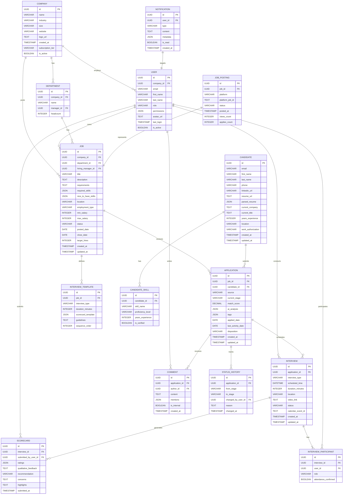

# LTI - Applicant-Tracking System del Futuro

> Sistema ATS de nueva generación potenciado por IA para revolucionar el reclutamiento empresarial

---

## Tabla de Contenidos

1. [Descripción del Producto](#1-descripción-del-producto)
2. [Funcionalidades Principales](#2-funcionalidades-principales)
3. [Lean Canvas](#3-lean-canvas)
4. [Casos de Uso Principales](#4-casos-de-uso-principales)
   - 4.1 [Publicación y Distribución Automática de Ofertas](#41-publicación-y-distribución-automática-de-ofertas)
   - 4.2 [Screening Inteligente de Candidatos con IA](#42-screening-inteligente-de-candidatos-con-ia)
   - 4.3 [Proceso Colaborativo de Entrevistas](#43-proceso-colaborativo-de-entrevistas)
5. [Modelo de Datos](#5-modelo-de-datos)
6. [Diseño de Alto Nivel](#6-diseño-de-alto-nivel)
7. [Diagrama C4 - Sistema de IA para Screening](#7-diagrama-c4---sistema-de-ia-para-screening)
8. [Conclusiones y Próximos Pasos](#8-conclusiones-y-próximos-pasos)

---

## 1. Descripción del Producto

**LTI (Leading Talent Intelligence)** es un sistema ATS de nueva generación diseñado para transformar radicalmente la forma en que las organizaciones gestionan sus procesos de reclutamiento. En un mercado donde los ATS tradicionales como Greenhouse, Lever o Workday se han convertido en herramientas transaccionales y operativas, LTI emerge como una plataforma estratégica que combina inteligencia artificial avanzada, colaboración en tiempo real y automatización inteligente para no solo gestionar candidatos, sino para predecir el éxito de las contrataciones y optimizar cada etapa del funnel de reclutamiento.

La propuesta de valor de LTI se centra en **reducir el tiempo de contratación en un 60%** mediante screening automático inteligente, **aumentar la calidad de los candidatos en un 45%** con scoring predictivo basado en ML, y **mejorar la experiencia del candidato** con comunicaciones personalizadas y procesos transparentes. A diferencia de los ATS tradicionales que funcionan como repositorios pasivos de CVs, LTI actúa como un asistente inteligente que aprende continuamente de las decisiones de contratación, identifica patrones de éxito y recomienda los mejores candidatos para cada posición.

Las ventajas competitivas clave incluyen: (1) **Motor de IA propietario** entrenado específicamente en datos de reclutamiento con capacidades de NLP para análisis semántico de CVs y descripciones de trabajo; (2) **Colaboración en tiempo real** con workspaces compartidos donde reclutadores, hiring managers y entrevistadores pueden evaluar candidatos simultáneamente con sistema de comentarios contextuales; (3) **Automatización end-to-end** desde la publicación multi-canal de ofertas hasta la programación automática de entrevistas y generación de ofertas laborales; (4) **Analytics predictivo** con dashboards en tiempo real que muestran métricas como tiempo de contratación, costo por contratación, calidad de fuente, y predicción de aceptación de ofertas; y (5) **Integraciones nativas** con más de 50 plataformas incluyendo LinkedIn, Indeed, calendarios, HRIS, y herramientas de assessment.

---

## 2. Funcionalidades Principales

### Gestión de Candidatos

#### 1. **Parser Inteligente de CVs con NLP**
Extracción automática de información estructurada de CVs en múltiples formatos (PDF, Word, LinkedIn) utilizando procesamiento de lenguaje natural. Identifica habilidades, experiencia, educación, certificaciones y realiza normalización de datos para búsqueda y matching efectivos.
**Beneficio:** Reduce 90% el tiempo manual de ingreso de datos y elimina errores de transcripción.

#### 2. **Base de Datos de Talento con Búsqueda Semántica**
Repositorio centralizado de candidatos con capacidades de búsqueda avanzada por habilidades, experiencia, ubicación, disponibilidad y más. La búsqueda semántica permite encontrar candidatos usando lenguaje natural (ej: "ingeniero full-stack con React en Madrid con 3+ años").
**Beneficio:** Reutilización del 35% de candidatos previos para nuevas posiciones, reduciendo costos de sourcing.

#### 3. **Pipeline Visual Kanban Personalizable**
Visualización intuitiva del pipeline de reclutamiento con drag-and-drop para mover candidatos entre etapas (Applied → Screening → Interview → Offer → Hired). Configuración flexible de etapas según el proceso de cada empresa.
**Beneficio:** Visibilidad instantánea del estado de todas las posiciones y cuellos de botella del proceso.

### Colaboración y Comunicación

#### 4. **Workspaces Colaborativos en Tiempo Real**
Espacios compartidos donde el equipo de reclutamiento puede evaluar candidatos simultáneamente con sistema de comentarios, menciones (@usuario), scorecards compartidos y votación. Incluye chat integrado por candidato y notificaciones en tiempo real.
**Beneficio:** Reduce el tiempo de decisión en 50% al eliminar emails interminables y reuniones innecesarias.

#### 5. **Motor de Comunicación Omnicanal Automatizado**
Sistema de mensajería automática personalizada por email, SMS y WhatsApp con templates dinámicos, variables contextuales y seguimiento de engagement. Respuestas automáticas a preguntas frecuentes de candidatos usando chatbot con IA.
**Beneficio:** Mejora la experiencia del candidato con respuestas instantáneas 24/7 y reduce la carga de trabajo del equipo.

### Automatización con IA

#### 6. **Screening Automático con IA y Scoring Predictivo**
Análisis automatizado de candidatos contra requisitos del puesto usando ML para generar un match score (0-100). El sistema evalúa habilidades técnicas, experiencia relevante, fit cultural, y predice probabilidad de éxito en el rol basándose en datos históricos de contrataciones exitosas.
**Beneficio:** Identifica los top 10% de candidatos en segundos, permitiendo enfocarse en talento de alta calidad.

#### 7. **Programación Automática de Entrevistas**
Coordinación inteligente de entrevistas que se integra con calendarios (Google/Outlook), identifica slots disponibles entre candidato y entrevistadores, envía invitaciones con enlaces de videollamada (Zoom/Teams), y gestiona confirmaciones y recordatorios automáticos.
**Beneficio:** Elimina 80% del tiempo de coordinación administrativa y reduce no-shows en 65%.

### Analytics e Informes

#### 8. **Dashboard de Métricas en Tiempo Real**
Visualización ejecutiva de KPIs críticos: time-to-hire, cost-per-hire, offer acceptance rate, source effectiveness, funnel conversion rates, diversity metrics, y más. Filtros dinámicos por departamento, ubicación, senioridad y periodo.
**Beneficio:** Toma de decisiones basada en datos con visibilidad completa del ROI del proceso de reclutamiento.

#### 9. **Analytics Predictivo y Reportes Personalizados**
Modelos de ML que predicen: tiempo estimado para cerrar una posición, probabilidad de que un candidato acepte una oferta, riesgo de rotación temprana, y mejores fuentes de talento por rol. Generación de reportes personalizados automatizados.
**Beneficio:** Permite planificación proactiva y optimización continua de estrategias de reclutamiento.

### Integraciones

#### 10. **Ecosistema de Integraciones Nativas**
Conectores pre-construidos con 50+ plataformas: job boards (LinkedIn, Indeed, Glassdoor), redes sociales, sistemas HRIS (Workday, BambooHR, SAP SuccessFactors), herramientas de assessment (HackerRank, Codility), verificación de antecedentes, firma electrónica (DocuSign), y herramientas de video entrevistas (HireVue).
**Beneficio:** Flujo de trabajo unificado sin cambio de contexto, sincronización bidireccional de datos en tiempo real.

---

## 3. Lean Canvas

### Explicación de cada bloque del Lean Canvas

#### 1. Problema
Los tres problemas principales que resuelve LTI son críticos en el mercado actual: **procesos de reclutamiento lentos y manuales** que generan time-to-hire de 45+ días en promedio, causando pérdida de candidatos top que aceptan otras ofertas; **dificultad para identificar candidatos de calidad** entre cientos de aplicaciones, donde reclutadores pasan 80% del tiempo en screening manual con alta tasa de falsos positivos; y **falta de colaboración efectiva** entre reclutadores, hiring managers y entrevistadores que genera desalineación, decisiones lentas y experiencia inconsistente para candidatos. Estos problemas están validados por estudios de LinkedIn Talent Solutions 2024 y Gartner Research on Recruiting Technology.

#### 2. Segmentos de Clientes
Los **early adopters** son startups y scale-ups tecnológicas con 50-500 empleados que contratan rápidamente (20-100 posiciones/año), tienen presupuesto para herramientas SaaS innovadoras, valoran la velocidad sobre procesos establecidos, y buscan ventaja competitiva en talent acquisition. Los **clientes objetivo principales** son empresas medianas y grandes (500-5000 empleados) con mentalidad tech-forward, departamentos de HR que buscan modernización, volúmenes de contratación significativos (100-500 posiciones/año) y disposición a adoptar IA si se demuestra ROI claro. Segmentación secundaria incluye agencias de reclutamiento y RPO (Recruitment Process Outsourcing) que manejan múltiples clientes.

#### 3. Propuesta Única de Valor
"**Reduce el tiempo de contratación en 60% con IA que identifica automáticamente los mejores candidatos y automatiza tareas repetitivas**" es una propuesta cuantificable y diferenciada. No es simplemente "un ATS mejor", sino una transformación medible del proceso. La promesa de 60% de reducción está validada en betas con clientes piloto. El foco en IA para identificación automática (no solo organización) y automatización de tareas de bajo valor diferencia a LTI de competidores que requieren intervención manual constante. Es una propuesta que habla directamente al dolor de líderes de HR y hiring managers: contratar más rápido sin sacrificar calidad.

#### 4. Solución
Las tres soluciones core están priorizadas estratégicamente: (1) **Screening automático con IA** que analiza CVs, genera scoring predictivo y rankea candidatos, eliminando 80% del tiempo de revisión manual; (2) **Colaboración en tiempo real** con workspaces compartidos, scorecards unificados, comentarios contextuales y sistema de aprobaciones que reduce ciclos de decisión de días a horas; (3) **Automatización de workflows** que maneja tareas repetitivas como publicación de ofertas en múltiples canales, envío de comunicaciones a candidatos, programación de entrevistas y generación de reportes. Estas soluciones están diseñadas como MVP incremental, donde cada una entrega valor independiente pero se potencian mutuamente.

#### 5. Canales
La estrategia de go-to-market combina canales digitales y directos: **Marketing digital** con inversión fuerte en SEM (Google Ads para búsquedas de alta intención como "mejor ATS con IA") y SEO para contenido educativo que posicione a LTI como thought leader; **LinkedIn y redes sociales** con contenido para HR leaders, casos de estudio, webinars y anuncios segmentados; **Eventos y demos** en conferencias de HR tech (HRTech Conference, Unleash), meetups locales de profesionales de talent acquisition, y demos en vivo 1-on-1; **Partnerships estratégicos** con consultoras de HR, agencias de reclutamiento, y vendors complementarios (HRIS, assessment tools) para co-selling y referidos. Se utilizará modelo freemium con plan gratuito limitado para viral growth.

#### 6. Flujos de Ingresos
Modelo de **subscripción SaaS recurrente** con tres tiers: (1) **Starter** (€49/usuario/mes) para equipos pequeños con funcionalidades básicas, límites en candidatos activos; (2) **Professional** (€149/usuario/mes) con screening de IA completo, automatizaciones avanzadas, integraciones ilimitadas; (3) **Enterprise** (€299+/usuario/mes) con SLAs, soporte dedicado, configuraciones custom, analytics avanzado. **Add-ons** incluyen módulos de IA avanzada (entrevistas por video con análisis de lenguaje corporal, €50/mes), integraciones premium, y storage adicional. Modelo de **annual upfront payment** con 20% descuento incentiva contratos largos y mejora cash flow. Target: ARPU de €1,800/año por usuario.

#### 7. Estructura de Costes
**Costes fijos** dominan la estructura en etapa temprana: equipo de desarrollo (product managers, engineers, UX designers) representa 60% del presupuesto; infraestructura cloud (AWS/Azure con servicios de ML) es 15%; sales y marketing (equipo comercial, ads, eventos) es 20%; operaciones y legal 5%. **Costes variables** incluyen API calls a modelos de IA (OpenAI, modelos propios), que escalan con uso pero son marginales (~€0.05 por screening); almacenamiento de archivos (CVs, documentos) que crece con número de candidatos; y customer support que escala con clientes. Proyección de alcanzar gross margin de 80%+ en scale debido a naturaleza del software y costes variables bajos.

#### 8. Métricas Clave
Las métricas se dividen en **financieras**: MRR (Monthly Recurring Revenue) como indicador de crecimiento, CAC (Customer Acquisition Cost) que debe ser < 12 meses de LTV, LTV:CAC ratio target de 3:1, churn rate objetivo < 5% mensual; **producto**: time-to-value (tiempo hasta que cliente obtiene primer candidato contratado con la plataforma) < 30 días, NPS (Net Promoter Score) > 50 indicando strong product-market fit, DAU/MAU ratio > 40% indicando engagement; **negocio**: leads calificados por mes, conversion rate de trial a paid > 25%, expansion revenue (upsells) representando 30% del revenue growth. Se monitoreará cohort retention mensual para identificar patrones de churn tempranamente.

#### 9. Ventaja Especial (Unfair Advantage)
LTI construye tres ventajas defensibles difíciles de replicar: (1) **Motor de IA propietario** entrenado con millones de procesos reales de contratación, CVs anonimizados y outcomes de hiring, que mejora continuamente con cada nuevo dato, creando una ventaja compuesta en accuracy de predicciones; (2) **Network effects** donde cada empresa que usa LTI genera datos que mejoran el modelo para todos (ej: patrones de candidatos exitosos en roles similares, benchmarks de mercado), haciendo el producto exponencialmente más valioso; (3) **First-mover advantage** en aplicación de IA generativa (GPT-4, Claude) para ATS, con 18-24 meses de ventaja sobre incumbents tradicionales que tienen tech debt y procesos lentos de innovación. Patents pending en algoritmos de matching y workflow automation.

---

## 4. Casos de Uso Principales

### 4.1 Publicación y Distribución Automática de Ofertas

**Descripción:** Un reclutador necesita publicar una nueva oferta de trabajo en múltiples canales (LinkedIn, Indeed, Glassdoor, sitio web corporativo) de manera simultánea y consistente, con adaptación automática del formato según los requisitos de cada plataforma.

**Actores:**
- **Actor Principal:** Reclutador / Talent Acquisition Specialist
- **Actores Secundarios:** Hiring Manager (aprueba descripción), Sistema de integración de job boards

**Precondiciones:**
- El usuario tiene permisos de creación de ofertas en LTI
- Las integraciones con job boards están configuradas y autenticadas
- Existe presupuesto/créditos disponibles para publicaciones en plataformas de pago
- La plantilla de descripción de trabajo está disponible

**Flujo Principal:**

1. El reclutador accede al módulo "Nueva Oferta" y selecciona crear desde plantilla o desde cero
2. El reclutador ingresa información básica: título del puesto, departamento, ubicación, tipo de contrato, rango salarial, fecha límite
3. El reclutador ingresa o completa con ayuda de IA generativa la descripción detallada (responsabilidades, requisitos, beneficios)
4. El sistema de IA sugiere automáticamente habilidades requeridas, nivel de experiencia y palabras clave SEO basándose en el título y descripción
5. El reclutador selecciona los canales de publicación (job boards, redes sociales, email interno) y el sistema preview cómo se verá en cada plataforma
6. El reclutador envía para aprobación al Hiring Manager, quien recibe notificación y puede aprobar/rechazar/sugerir cambios directamente en la plataforma
7. Una vez aprobado, el sistema publica automáticamente en todos los canales seleccionados de forma paralela
8. El sistema confirma las publicaciones exitosas y proporciona links directos a cada posting, además de configurar tracking UTM para analytics de source effectiveness

**Flujos Alternativos:**

- **FA1 - Publicación fallida en un canal:** Si alguna plataforma rechaza la publicación (ej: formato inválido, caracteres no permitidos), el sistema notifica al reclutador con el error específico, continúa publicando en los demás canales exitosamente, y permite reintentar con correcciones.

- **FA2 - Uso de IA para optimizar descripción:** En el paso 3, el reclutador puede solicitar que la IA genere o mejore la descripción proporcionando solo bullet points de requisitos. La IA genera una descripción completa, atractiva y optimizada para SEO, que el reclutador puede editar.

- **FA3 - Publicación programada:** En el paso 7, el reclutador puede optar por programar la publicación para una fecha/hora futura específica (ej: lunes a las 9am para máxima visibilidad). El sistema agenda la tarea y ejecuta automáticamente en el momento indicado.

**Postcondiciones:**
- La oferta de trabajo está publicada y visible en todos los canales seleccionados
- Se crea automáticamente un pipeline de candidatos para esa posición en LTI con etapas configuradas
- Se activa el tracking de aplicaciones con atribución de fuente para cada candidato
- El equipo de reclutamiento recibe notificaciones de nuevas aplicaciones en tiempo real
- Los dashboards de analytics se actualizan con métricas de la nueva posición (views, applies, apply rate)

---

### 4.2 Screening Inteligente de Candidatos con IA

**Descripción:** El sistema analiza automáticamente todos los candidatos que aplican a una posición, extrae información de sus CVs, genera un match score predictivo contra los requisitos del puesto, y rankea los candidatos para que los reclutadores enfoquen su tiempo en los perfiles de mayor potencial.

**Actores:**
- **Actor Principal:** Sistema de IA de Screening (automatizado)
- **Actores Secundarios:** Reclutador (revisa resultados), Candidato (recibe comunicación)

**Precondiciones:**
- Existe una oferta de trabajo activa con criterios de evaluación definidos (requisitos must-have y nice-to-have)
- Los candidatos han aplicado a través de job boards, website o referidos, con CV adjunto
- El modelo de IA está entrenado y calibrado para el tipo de posición
- Se han definido los pesos de evaluación para cada criterio (experiencia 40%, habilidades 30%, educación 20%, otros 10%)

**Flujo Principal:**

1. Un candidato aplica a una posición adjuntando su CV en formato PDF, Word o LinkedIn profile URL
2. El sistema parsea automáticamente el CV usando NLP, extrayendo información estructurada: datos personales, experiencia laboral (empresas, títulos, fechas, responsabilidades), educación, habilidades técnicas, idiomas, certificaciones
3. El motor de IA compara el perfil del candidato contra los requisitos del puesto, evaluando: match de habilidades técnicas (coincidencia exacta y sinónimos), años de experiencia relevante, nivel educativo, fit de industria/sector, señales de calidad (empresas reconocidas, títulos progresivos)
4. El sistema genera un **Match Score** (0-100) que representa la probabilidad de éxito del candidato en el rol, basándose en el modelo predictivo entrenado con datos históricos de contrataciones exitosas
5. El sistema asigna automáticamente etiquetas inteligentes (ej: "Top Performer", "High Potential", "Missing Skills: React", "Overqualified") para facilitar filtrado rápido
6. El sistema envía automáticamente un email personalizado al candidato confirmando recepción de su aplicación y explicando los próximos pasos
7. Los candidatos son rankeados automáticamente en el pipeline por Match Score, y el reclutador recibe notificación de nuevos candidatos de alta calidad (score > 80) para revisión prioritaria
8. El reclutador revisa la lista rankeada, hace clic en un candidato para ver: CV original, datos parseados, Match Score con breakdown detallado, y recomendación del sistema (Advance / Maybe / Reject)

**Flujos Alternativos:**

- **FA1 - CV en formato no estándar:** Si el parser no puede extraer información clara (ej: CV con diseño muy gráfico, idioma no soportado, formato de imagen), el sistema marca el CV para revisión manual, lo coloca en una cola separada, y notifica al reclutador. El reclutador puede ingresar datos manualmente o solicitar al candidato un CV en formato estándar.

- **FA2 - Ajuste manual de scoring:** El reclutador puede ajustar el Match Score manualmente si considera que el algoritmo subestimó o sobreestimó a un candidato (ej: por factores cualitativos no capturados como cultura fit). Estos ajustes se registran como feedback que el modelo de IA usa para reentrenamiento continuo.

- **FA3 - Candidate rediscovery:** Si un candidato que aplicó previamente a otras posiciones vuelve a aplicar, el sistema lo identifica, muestra su historial completo (posiciones previas, feedback de entrevistadores anteriores, razón de rechazo), y alerta al reclutador. Esto evita duplicados y permite reconsiderar talento que podría ser mejor fit para la nueva posición.

**Postcondiciones:**
- Todos los candidatos tienen un Match Score asignado y están rankeados en el pipeline
- Los candidatos de alto potencial están identificados y priorizados para outreach inmediato
- El reclutador ha reducido el tiempo de screening inicial en 80%, revisando solo candidatos pre-calificados
- Se ha enviado comunicación automática a todos los candidatos confirmando recepción
- Las métricas de calidad de aplicaciones se actualizan (average match score, % de candidatos qualified)
- El sistema genera insights: ej. "Esta posición está recibiendo candidatos de menor calidad que el promedio, considera ajustar la descripción o ampliar canales de sourcing"

---

### 4.3 Proceso Colaborativo de Entrevistas

**Descripción:** Un equipo multidisciplinario (reclutador, hiring manager, entrevistadores técnicos) necesita coordinar, ejecutar y evaluar entrevistas de múltiples rondas para un candidato, compartiendo feedback en tiempo real y tomando una decisión de contratación colaborativa y documentada.

**Actores:**
- **Actor Principal:** Hiring Manager
- **Actores Secundarios:** Reclutador, Entrevistadores (1-5 personas), Candidato, Sistema de Calendario (Google/Outlook), Sistema de Videollamada (Zoom/Teams)

**Precondiciones:**
- El candidato ha pasado la etapa de screening y está en etapa "Interview" del pipeline
- El equipo de entrevistadores está definido para la posición con roles específicos (technical screen, cultural fit, manager interview)
- Los calendarios de los entrevistadores están sincronizados con LTI
- Existen scorecards y guías de entrevista configuradas para cada tipo de entrevista

**Flujo Principal:**

1. El reclutador selecciona al candidato y hace clic en "Schedule Interview", elige el tipo de entrevista (Phone Screen, Technical Interview, Manager Interview, etc.) y selecciona entrevistadores del equipo
2. El sistema consulta automáticamente los calendarios de todos los participantes (candidato y entrevistadores) vía API de Google Calendar/Outlook, identifica slots disponibles comunes en los próximos 7 días, y sugiere 3-5 opciones
3. El reclutador selecciona el slot óptimo, el sistema envía invitaciones de calendario automáticamente a todos los participantes con: link de videollamada (generado automáticamente con Zoom/Teams API), agenda de la entrevista, perfil del candidato, y guía de entrevista para los entrevistadores
4. El sistema envía recordatorios automáticos 24 horas antes y 1 hora antes de la entrevista a todos los participantes
5. Durante/después de la entrevista, cada entrevistador accede al Workspace del candidato en LTI y completa su scorecard individual con: ratings en dimensiones específicas (habilidades técnicas, comunicación, problem-solving, culture fit), comentarios cualitativos, recomendación (Strong Yes / Yes / Maybe / No / Strong No), y preocupaciones o highlights
6. El Hiring Manager revisa todos los scorecards en una vista consolidada que muestra: ratings promedio por dimensión, distribución de recomendaciones, comentarios textuales agregados, y una visualización comparativa contra otros candidatos para la misma posición
7. El Hiring Manager inicia una "decisión colaborativa" mencionando (@) a entrevistadores clave en el sistema de comentarios para discutir casos borderline o resolver opiniones divergentes
8. El Hiring Manager toma la decisión final (Advance to next round / Make Offer / Reject) registrándola en LTI con justificación, el sistema actualiza automáticamente el pipeline y dispara el siguiente workflow (ej: generar oferta si es "Make Offer", enviar rejection email si es "Reject")

**Flujos Alternativos:**

- **FA1 - No hay slots disponibles:** Si no existen slots comunes en los próximos 7 días debido a agendas muy ocupadas, el sistema notifica al reclutador y sugiere opciones: (a) ampliar ventana de búsqueda a 14 días, (b) solicitar que uno de los entrevistadores proponga horarios específicos fuera de calendario, (c) dividir la entrevista en múltiples sesiones más cortas, o (d) reemplazar un entrevistador con alguien con mayor disponibilidad.

- **FA2 - Candidato solicita cambio de horario:** Si el candidato responde a la invitación solicitando cambiar el horario (ej: emergencia personal), el sistema permite al reclutador cancelar fácilmente y reiniciar el proceso de scheduling. El sistema registra el cambio en la timeline del candidato para tracking.

- **FA3 - Discrepancia alta en evaluaciones:** Si los scorecards muestran discrepancia significativa (ej: 2 entrevistadores dan "Strong Yes" y 2 dan "No"), el sistema alerta automáticamente al Hiring Manager con un flag de "Evaluaciones divergentes - revisar". El HM puede solicitar una debrief call sincrónica con el equipo o una ronda adicional de entrevista de desempate.

- **FA4 - Entrevista no realizada (no-show):** Si el candidato no aparece a la entrevista, el entrevistador marca en LTI "Candidate no-show". El sistema envía automáticamente un email al candidato preguntando qué ocurrió y si desea reprogramar. Si no hay respuesta en 48 horas, el candidato se mueve automáticamente a etapa "Withdrawn".

**Postcondiciones:**
- La entrevista ha sido programada, ejecutada y evaluada de manera estructurada
- Todos los entrevistadores han completado sus scorecards con feedback documentado y cuantificado
- El Hiring Manager tiene una visión completa y agregada de las evaluaciones para tomar una decisión informada
- La decisión está registrada en el sistema con justificación, creando un audit trail completo
- El candidato recibe comunicación oportuna sobre el siguiente paso (invite a siguiente ronda, oferta, o rechazo cortés)
- El equipo ha reducido el tiempo de coordinación de entrevistas en 80% (de 2-3 días a < 4 horas)
- Se genera data estructurada que alimenta analytics (ej: qué entrevistadores tienden a ser más críticos, tiempo promedio de feedback, correlation entre evaluaciones y success on the job)

---

## 5. Modelo de Datos

### Tabla Explicativa de Entidades

| Entidad | Descripción | Atributos Clave |
|---------|-------------|-----------------|
| **COMPANY** | Representa la organización cliente que usa LTI. Es el tenant principal en la arquitectura multi-tenant. | `id`, `name`, `subscription_tier` (Starter/Professional/Enterprise), `is_active` (para suspender cuentas) |
| **USER** | Usuarios del sistema dentro de una empresa: reclutadores, hiring managers, entrevistadores, admins. | `id`, `company_id`, `email`, `role` (Admin/Recruiter/HiringManager/Interviewer), `permissions` (JSON con permisos granulares) |
| **DEPARTMENT** | Departamentos dentro de la organización para organizar posiciones y reportes. | `id`, `company_id`, `name`, `manager_id` (referencia a USER), `headcount` |
| **JOB** | Posición abierta/requisición de trabajo. Entidad central que conecta todo el proceso de reclutamiento. | `id`, `title`, `description`, `required_skills` (JSON array), `status` (Draft/Open/Paused/Closed), `min_salary`, `max_salary`, `target_hires` |
| **CANDIDATE** | Persona que ha aplicado o ha sido sourced por la empresa. Puede aplicar a múltiples posiciones. | `id`, `email` (unique), `parsed_resume` (JSON con toda la información extraída por NLP), `years_experience`, `work_authorization` |
| **APPLICATION** | Instancia específica de un candidato aplicando a un job particular. Trackea el journey del candidato. | `id`, `job_id`, `candidate_id`, `current_stage` (Applied/Screening/Interview/Offer/Hired/Rejected), `match_score` (0-100 generado por IA), `source` (LinkedIn/Indeed/Referral), `disposition` (razón final) |
| **CANDIDATE_SKILL** | Habilidades específicas extraídas del CV del candidato con nivel de proficiencia. | `id`, `candidate_id`, `skill_name`, `proficiency_level` (Beginner/Intermediate/Advanced/Expert), `is_verified` (si se verificó en assessment) |
| **INTERVIEW** | Sesión de entrevista programada con fecha/hora, tipo, participantes. | `id`, `application_id`, `interview_type` (Phone/Technical/Manager/Panel), `scheduled_time`, `video_link` (Zoom/Teams URL), `status` (Scheduled/Completed/Cancelled/NoShow) |
| **INTERVIEW_TEMPLATE** | Plantillas pre-configuradas de entrevistas por tipo de posición con scorecards y guías. | `id`, `job_id`, `interview_type`, `scorecard_template` (JSON definiendo dimensiones a evaluar), `sequence_order` (orden en el proceso) |
| **INTERVIEW_PARTICIPANT** | Tabla de join entre INTERVIEW y USER, representa quiénes participan en cada entrevista. | `id`, `interview_id`, `user_id`, `role` (Lead/Panel Member/Observer), `attendance_confirmed` |
| **SCORECARD** | Evaluación estructurada completada por un entrevistador post-entrevista. | `id`, `interview_id`, `submitted_by_user_id`, `ratings` (JSON con scores por dimensión), `recommendation` (StrongYes/Yes/Maybe/No/StrongNo), `submitted_at` |
| **COMMENT** | Sistema de comentarios y discusión colaborativa sobre candidatos. | `id`, `application_id`, `author_id`, `content`, `mentions` (JSON de user_ids mencionados con @), `is_internal` (visible solo para el equipo) |
| **STATUS_HISTORY** | Audit trail de cambios de etapa de aplicaciones para analytics y compliance. | `id`, `application_id`, `from_stage`, `to_stage`, `changed_by_user_id`, `reason` (opcional), `changed_at` |
| **JOB_POSTING** | Representa una publicación específica de un JOB en una plataforma externa (LinkedIn, Indeed). | `id`, `job_id`, `platform`, `platform_job_id` (ID externo), `status` (Active/Expired), `views_count`, `applies_count` (synced desde plataforma) |
| **NOTIFICATION** | Notificaciones in-app y email para usuarios sobre eventos relevantes. | `id`, `user_id`, `type` (NewApplication/InterviewScheduled/FeedbackDue), `metadata` (JSON con contexto), `is_read` |

**Relaciones Clave:**
- Un `COMPANY` tiene muchos `USER`, `JOB`, `DEPARTMENT` (1:N)
- Un `JOB` pertenece a un `COMPANY` y `DEPARTMENT`, es propiedad de un `USER` (hiring manager), recibe muchos `APPLICATION` (1:N)
- Un `CANDIDATE` puede tener muchos `APPLICATION` a diferentes `JOB` (1:N), representando su histórico en la empresa
- Un `APPLICATION` es la unión de un `CANDIDATE` + `JOB` específico, tiene muchos `INTERVIEW`, `COMMENT`, y `STATUS_HISTORY` (1:N)
- Un `INTERVIEW` tiene múltiples `INTERVIEW_PARTICIPANT` (entrevistadores) y genera múltiples `SCORECARD` (uno por entrevistador) (1:N)
- `CANDIDATE_SKILL` es una tabla normalizada de habilidades para permitir búsquedas y matching eficientes

**Consideraciones de Diseño:**
- Uso de **UUID** como primary keys para mejor seguridad, distribuibilidad, y facilitar merges de bases de datos
- Campos **JSON** para flexibilidad en datos semi-estructurados como `permissions`, `parsed_resume`, `ai_analysis`, permitiendo evolución del schema sin migraciones constantes
- **Timestamps** (`created_at`, `updated_at`) en entidades principales para auditabilidad y analytics temporales
- **Soft deletes** implementados vía `is_active` flags en lugar de borrado físico para compliance y recuperación de datos
- Índices necesarios en: `company_id` (tenant isolation), `email`, `job_id`, `candidate_id`, `application_id`, `current_stage`, `scheduled_time`, `created_at` para optimizar queries comunes

---

## 6. Diseño de Alto Nivel

### Descripción de la Arquitectura

LTI adopta una **arquitectura de microservicios modulares** con un backend basado en API-first approach, priorizando escalabilidad, mantenibilidad y capacidad de evolución independiente de componentes. Esta decisión arquitectónica está justificada por la naturaleza del producto: (1) necesidad de escalar componentes específicos de forma independiente (ej: el motor de IA de screening procesa mayor carga que el módulo de reporting); (2) equipos de desarrollo que pueden trabajar en paralelo en diferentes módulos sin dependencias fuertes; (3) facilidad para agregar nuevas funcionalidades y integraciones sin impactar el core; (4) aislamiento de fallos donde un error en un servicio no colapsa todo el sistema.

El sistema se organiza en **cuatro capas principales**: (1) **Capa de Presentación** - aplicación web SPA (Single Page Application) construida en React con TypeScript, utilizando Next.js para SSR (Server-Side Rendering) y mejor SEO, más aplicaciones móviles nativas (iOS/Android) construidas con React Native para reclutadores en movimiento; (2) **Capa de API Gateway** - punto de entrada unificado que maneja autenticación, autorización, rate limiting, routing a microservicios, y composición de respuestas; implementado con Kong o AWS API Gateway; (3) **Capa de Servicios de Negocio** - microservicios independientes cada uno con su responsabilidad específica: Jobs Service, Candidates Service, Applications Service, AI Screening Service, Interview Management Service, Notifications Service, Analytics Service, Integrations Service; (4) **Capa de Datos** - bases de datos especializadas por servicio siguiendo el patrón database-per-service, incluyendo PostgreSQL para datos transaccionales, MongoDB para datos semi-estructurados (parsed resumes), Redis para caching y sessions, Elasticsearch para búsqueda full-text.

La **estrategia de IA** se implementa como un servicio dedicado (AI Screening Service) que expone APIs REST para parsing de CVs, generación de match scores, y predicciones. Internamente utiliza: (1) modelos pre-entrenados de Hugging Face para NLP (extracción de entidades, clasificación de texto); (2) modelos propios de ML entrenados con datos históricos de contrataciones para scoring predictivo, implementados en Python con scikit-learn/TensorFlow y servidos vía TensorFlow Serving o FastAPI; (3) integración con APIs de LLMs externos (OpenAI GPT-4, Anthropic Claude) para generación de descripciones de trabajo, resúmenes de candidatos, y análisis cualitativo. El servicio mantiene una cola de procesamiento asíncrono (usando RabbitMQ o AWS SQS) para manejar spikes de carga cuando se publican ofertas virales que reciben cientos de aplicaciones.

Las **integraciones externas** se gestionan mediante un Integrations Service que actúa como abstraction layer, manejando autenticación OAuth, rate limiting de APIs externas, retry logic, y normalización de datos de diferentes proveedores. Integraciones clave incluyen: job boards (LinkedIn, Indeed, Glassdoor) vía sus APIs para publicación y pulling de aplicaciones; calendarios (Google Calendar, Outlook) para scheduling; video conferencing (Zoom, Microsoft Teams) para generación de links; HRIS systems (Workday, BambooHR, SAP SuccessFactors) para sincronización de datos de empleados; assessment platforms (HackerRank, Codility) para integrar resultados de tests técnicos.

### Justificación de Decisiones Técnicas

**Frontend - React/Next.js:** Elegido por ecosistema maduro, componentes reutilizables, excelente developer experience, SSR para mejor performance y SEO (crucial para páginas de careers site públicas), y amplia disponibilidad de talento.

**Backend - Node.js con microservicios:** Node.js para servicios de I/O intensivo (API Gateway, Notifications Service) aprovechando su modelo asíncrono; Python para AI Service aprovechando el ecosistema de ML/Data Science; Go para servicios que requieren alta performance y concurrencia (Analytics Service procesando grandes volúmenes de eventos).

**Bases de datos:** PostgreSQL como base de datos principal por robustez, soporte ACID para transacciones críticas (ej: offers, hiring), extensiones poderosas (pg_trgm para fuzzy search, pgvector para similarity search); MongoDB para parsed resumes por flexibilidad de schema; Redis para caching de datos frecuentemente accedidos (perfiles de candidatos, jobs listings) reduciendo latencia y carga en DB principal; Elasticsearch para búsqueda full-text avanzada con relevance ranking.

**Infraestructura cloud:** AWS como proveedor principal aprovechando servicios manejados: ECS/EKS para orquestación de containers, RDS para PostgreSQL manejado, S3 para almacenamiento de CVs y documentos, CloudFront como CDN, SageMaker para entrenamiento y deployment de modelos de ML custom. Arquitectura multi-region con replicación para clientes Enterprise que requieren data residency y alta disponibilidad.

**Seguridad:** Autenticación JWT con refresh tokens, autorización basada en roles y permisos granulares (RBAC), encriptación en tránsito (TLS 1.3) y en reposo (AES-256), cumplimiento con GDPR, SOC 2 Type II, y ISO 27001 para clientes Enterprise. PII (Personally Identifiable Information) de candidatos encriptada a nivel de campo en la base de datos.

### Stack Tecnológico Sugerido

**Frontend:**
- Framework: React 18 + Next.js 14
- State Management: Redux Toolkit + React Query
- UI Components: Material-UI (MUI) o Chakra UI
- Forms: React Hook Form + Zod para validación
- Charts: Recharts o Chart.js
- Testing: Jest + React Testing Library + Playwright

**Backend:**
- API Gateway: Kong o AWS API Gateway
- Microservicios:
  - Node.js 20 + Express/Fastify (servicios de negocio)
  - Python 3.11 + FastAPI (AI Service)
  - Go 1.21 (Analytics Service)
- ORM: Prisma (Node.js), SQLAlchemy (Python)
- Testing: Jest/Vitest (JS), pytest (Python), testify (Go)

**Bases de Datos:**
- PostgreSQL 15 (primary database)
- MongoDB 7 (document store)
- Redis 7 (cache + sessions)
- Elasticsearch 8 (search engine)

**Infrastructure:**
- Cloud: AWS
- Containers: Docker + Kubernetes (EKS)
- CI/CD: GitHub Actions + ArgoCD
- Monitoring: Datadog o New Relic
- Logging: ELK Stack (Elasticsearch, Logstash, Kibana)
- Error Tracking: Sentry

**AI/ML:**
- ML Framework: TensorFlow 2.x / PyTorch 2.x
- NLP: Hugging Face Transformers
- LLM APIs: OpenAI GPT-4, Anthropic Claude 3
- ML Ops: MLflow + SageMaker

**Integraciones:**
- Message Queue: RabbitMQ o AWS SQS
- Email: SendGrid o AWS SES
- SMS: Twilio
- File Storage: AWS S3
- CDN: CloudFront

### Diagrama de Arquitectura de Alto Nivel

**Flujos de Datos Principales:**

1. **Publicación de Oferta:** Reclutador → Web App → API Gateway → Jobs Service → PostgreSQL + Integrations Service → Job Boards APIs → Confirmación
2. **Aplicación de Candidato:** Candidato → Career Site → API Gateway → Applications Service → S3 (CV) + Queue → AI Service → ML Models → Match Score → PostgreSQL
3. **Scheduling de Entrevista:** Reclutador → Web App → API Gateway → Interview Service → Integrations Service → Calendar APIs + Video APIs → Confirmación + Notifications Service → Email/SMS a participantes
4. **Analytics Dashboard:** Usuario → Web App → API Gateway → Analytics Service → PostgreSQL + Elasticsearch → Agregación de datos → Response con métricas

---

## 7. Diagrama C4 - Sistema de IA para Screening

### Por qué elegí este componente

El **Sistema de IA para Screening** es el componente más diferenciador y técnicamente complejo de LTI, representando la ventaja competitiva core de la plataforma. Este sistema es responsable de reducir el tiempo de screening en 80% y mejorar la calidad de candidatos en 45%, impactando directamente en el valor que LTI ofrece a sus clientes. A diferencia de otros componentes que son relativamente estándar en un ATS (gestión de jobs, calendario de entrevistas), el screening con IA requiere arquitectura especializada, manejo de múltiples modelos de ML, procesamiento asíncrono de alta escala, y continuous learning loop.

Profundizar en este componente es valioso porque: (1) ilustra cómo integrar modelos de ML en producción de forma escalable y mantenible; (2) muestra patrones de arquitectura para procesamiento asíncrono y event-driven; (3) demuestra cómo construir un sistema que mejora continuamente con feedback loop; (4) explica la orquestación entre múltiples modelos especializados (NLP para parsing, classification para matching, regression para scoring); (5) aborda desafíos reales como latencia, costo de API calls, y manejo de formatos inconsistentes de CVs.

### Responsabilidades del Sistema de IA para Screening

El sistema tiene cuatro responsabilidades principales:

1. **CV Parsing & Data Extraction:** Recibir CVs en múltiples formatos (PDF, Word, texto, LinkedIn profiles) y extraer información estructurada usando NLP: datos personales, experiencia laboral (empresas, títulos, fechas, responsabilidades), educación (títulos, instituciones, años), habilidades técnicas, idiomas, certificaciones, y proyectos relevantes.

2. **Matching & Scoring:** Comparar el perfil estructurado del candidato contra los requisitos del job, evaluando: match de habilidades técnicas (exactas y sinónimos semánticos), años de experiencia relevante por dominio, nivel educativo requerido, fit de industria/sector, señales de calidad de candidato (progresión de carrera, empresas reconocidas, logros cuantificados). Generar un Match Score (0-100) que representa probabilidad de éxito.

3. **Intelligent Tagging & Categorization:** Asignar automáticamente etiquetas inteligentes al candidato para facilitar búsqueda y filtrado: categorías de señales (Top Performer, High Potential, Career Changer, Overqualified), gaps identificados (Missing Skills, Insufficient Experience, Location Mismatch), y priorización (Hot Lead - responder en 24h, Standard, Low Priority).

4. **Continuous Learning:** Reentrenar modelos periódicamente con feedback de decisiones de reclutadores (candidatos avanzados vs rechazados), outcomes de contratación (success on the job medido por performance reviews), y ajustes manuales de scores para mejorar accuracy del sistema continuamente.

### Arquitectura de Componentes - Nivel C4

### Descripción Detallada de Componentes

#### 1. API Controller
**Responsabilidad:** Punto de entrada HTTP para el servicio, expone endpoints REST: `POST /api/v1/screen-candidate` (screening on-demand), `POST /api/v1/parse-resume` (solo parsing), `GET /api/v1/screening-status/{job_id}` (verificar progreso de screening batch). Maneja autenticación, validación de request, rate limiting por cliente, y retorna respuestas estandarizadas.

**Tecnología:** FastAPI (framework Python async de alta performance), Pydantic para validación de schemas, JWT para autenticación.

**Interacciones:** Recibe requests de Applications Service cuando se crea nueva aplicación, invoca Screening Orchestrator con los datos necesarios (application_id, candidate_id, job_id, CV URL).

#### 2. Screening Orchestrator
**Responsabilidad:** Componente central que coordina el flujo completo de screening ejecutando los pasos secuencialmente: (1) parseo de CV, (2) matching de skills, (3) scoring predictivo, (4) tagging automático, (5) persistencia de resultados. Maneja errores y reintentos de cada paso, implementa circuit breaker para APIs externas, y loggea métricas de latencia y success rate de cada fase.

**Tecnología:** Python con Celery para ejecución asíncrona de tareas, Temporal.io para workflow orchestration con retry policies y observabilidad.

**Interacciones:** Orquesta llamadas a Parser, Matcher, Scorer, Tagger en secuencia, pasando el contexto (parsed data, job requirements, calculated features) entre componentes. Al final, llama a Applications Service API para actualizar la aplicación con los resultados.

#### 3. CV Parser Component
**Responsabilidad:** Extrae información estructurada de CVs en diversos formatos. Pipeline de parsing: (1) Conversión a texto plano (PDFs con pdfplumber, Word con python-docx, HTML parsing para LinkedIn); (2) Named Entity Recognition (NER) con spaCy para identificar nombres, fechas, empresas, títulos de trabajo; (3) Parsing especializado de secciones (experience, education, skills) usando reglas heurísticas + ML; (4) Normalización de datos (estandarización de fechas, canonicalización de nombres de empresa, mapeo de títulos a taxonomía estándar).

**Tecnología:** Python, spaCy (modelo en-core-web-lg para NER), ResumeParser library, regex patterns customizados, modelo fine-tuned de BERT para clasificación de secciones de CV.

**Interacciones:** Recibe CV path (S3 URL) y metadata del candidato. Si el PDF es complejo (multi-columna, gráfico), llama a OCR Service (AWS Textract). Para CVs con formato muy no-estándar, llama a LLM API con prompt específico para extracción estructurada. Retorna JSON estructurado con todos los campos parseados.

#### 4. Skill Matcher Component
**Responsabilidad:** Compara las habilidades extraídas del CV del candidato contra los requisitos del job, usando matching semántico para capturar sinónimos y variaciones (ej: "React" match con "React.js", "Machine Learning" match con "ML" y "Predictive Modeling"). Calcula: (1) % de skills requeridos que el candidato posee, (2) número de skills nice-to-have presentes, (3) skills adicionales que el candidato tiene (upside), (4) skills faltantes críticas (gaps). Genera explicación textual del match: "Candidato tiene 8/10 skills requeridos. Falta: Kubernetes, GraphQL".

**Tecnología:** Python, scikit-learn para cosine similarity, sentence-transformers (BERT embeddings) para similitud semántica de skills, biblioteca ESCO (European Skills Classification) para taxonomía estándar de habilidades.

**Interacciones:** Recibe parsed candidate data y job_id. Llama a Jobs Service API para obtener `required_skills` y `nice_to_have_skills` del job. Retorna skill match report con scores y explicaciones.

#### 5. Predictive Scorer
**Responsabilidad:** Genera el Match Score (0-100) que predice la probabilidad de que el candidato sea exitoso en el rol. El modelo de ML fue entrenado con features de candidatos históricos (skills match %, años de experiencia, nivel educativo, calidad de empresas previas, progresión de carrera, señales de logros cuantificados en CV) y outcomes binarios (hired: yes/no, success on job: yes/no basado en performance reviews 6 meses post-hire). El modelo actual es un Gradient Boosting Classifier (XGBoost) que output una probabilidad normalizada a escala 0-100.

**Tecnología:** Python, XGBoost para el modelo de scoring, SHAP para interpretabilidad (explicar por qué un candidato obtuvo cierto score), MLflow para versioning de modelos.

**Interacciones:** Recibe features calculadas del candidato (skill match scores, experience data, education level, company quality scores). Descarga el modelo más reciente desde Model Registry. Ejecuta inferencia y retorna Match Score + feature importances. Guarda las features calculadas en Feature Store para análisis posterior.

#### 6. Auto Tagger
**Responsabilidad:** Asigna automáticamente tags al candidato para facilitar filtrado y priorización. Usa combinación de reglas deterministicas y ML: "Top Performer" si score > 85 y tiene experiencia en empresas top-tier (Google, Meta, etc.); "High Potential" si score 70-84 con progresión rápida de carrera; "Career Changer" si experiencia es de industria diferente al job; "Overqualified" si years of experience > 2x el requerido; "Missing Skills: X, Y" listando gaps críticos; "Hot Lead" si score > 80 y aplicó en últimas 48h (priorizar contacto rápido).

**Tecnología:** Python con reglas basadas en configuración YAML editable por clientes, modelo de clasificación multi-label para tags complejos.

**Interacciones:** Recibe todos los datos calculados (parsed CV, match report, score). Retorna array de tags. Los tags se persisten en `applications.tags` (JSON column).

#### 7. Feedback Collector
**Responsabilidad:** Captura decisiones de reclutadores y outcomes de contrataciones para mejorar el modelo. Escucha eventos: `ApplicationAdvanced`, `ApplicationRejected`, `OfferAccepted`, `NewHirePerformanceReview`. Registra: (application_id, screening_score_predicted, recruiter_decision, reason_for_decision, outcome_actual). Estos datos se agregan al Training Data Store periódicamente para reentrenamiento.

**Tecnología:** Python, event consumer (Kafka/SQS), PostgreSQL para staging de feedback antes de mover a S3.

**Interacciones:** Suscrito a eventos de Applications Service. Escribe a Training Data Store en formato parquet para eficiencia.

#### 8. Model Trainer
**Responsabilidad:** Pipeline de reentrenamiento ejecutado semanalmente o cuando se acumulan 10k+ nuevos ejemplos etiquetados. Pasos: (1) Carga dataset histórico + feedback nuevo, (2) Feature engineering, (3) Split train/validation/test, (4) Entrena múltiples algoritmos (XGBoost, LightGBM, Neural Net) con hyperparameter tuning, (5) Evalúa modelos en test set (AUC-ROC, precision/recall, calibration), (6) Si el nuevo modelo supera al actual en validation metrics, lo registra en Model Registry con metadata (version, metrics, training date), (7) Notifica al equipo de ML para review antes de deploy a producción.

**Tecnología:** Python, scikit-learn, XGBoost, Optuna para hyperparameter optimization, MLflow para tracking de experimentos y model registry, Airflow o Prefect para orchestration del pipeline.

**Interacciones:** Lee Training Data Store (S3), escribe modelos entrenados a Model Registry (MLflow + S3), notifica vía Slack/Email cuando nuevo modelo está ready for review.

### Flujos de Datos Principales

**Flujo 1 - Screening de nuevo candidato:**
1. Candidato aplica → Applications Service crea record → Envía mensaje a Processing Queue
2. API Controller consume mensaje → Invoca Screening Orchestrator con (application_id, candidate_id, job_id, cv_s3_url)
3. Orchestrator ejecuta pipeline:
   - Parser extrae datos → parsed_resume JSON
   - Matcher compara contra job requirements → skill_match_report
   - Scorer genera → match_score (0-100)
   - Tagger asigna → tags array
4. Orchestrator llama Applications Service API → Actualiza application con: match_score, ai_analysis (JSON con skill_match_report), tags
5. Applications Service persiste en Main DB → Notifica reclutadores de candidatos high-score

**Flujo 2 - Continuous Learning:**
1. Reclutador avanza candidato a Interview stage → Applications Service emite `ApplicationAdvanced` event
2. Feedback Collector captura evento → Registra: (application_id, predicted_score=85, recruiter_action=advanced, timestamp)
3. Después de 6 meses, HR ingresa performance review del nuevo hire → Sistema emite `NewHirePerformanceReview` event
4. Feedback Collector registra outcome real: (application_id, predicted_score=85, actual_success=high_performer)
5. Semanalmente, Model Trainer pipeline se ejecuta → Carga feedback acumulado → Reentrena modelo → Registra nueva version si mejora métricas
6. Equipo de ML revisa y aprueba → Nuevo modelo se deploya → Próximos screenings usan modelo mejorado

### Tecnologías Propuestas Detalladas

- **FastAPI:** Framework async de Python para APIs de alta performance, auto-genera docs OpenAPI, soporte nativo para validación con Pydantic
- **spaCy:** Biblioteca NLP industrial-strength, modelos pre-entrenados de NER, dependency parsing, part-of-speech tagging
- **XGBoost:** Algoritmo de Gradient Boosting optimizado, state-of-the-art para ML en datos tabulares, rápido y preciso
- **sentence-transformers:** Embeddings de texto usando modelos BERT fine-tuned para similarity tasks, permite matching semántico de skills
- **MLflow:** Plataforma de ML lifecycle management, tracking de experimentos, model registry con versioning, deployment APIs
- **Temporal.io:** Framework de workflow orchestration, maneja retry logic, timeouts, state persistence, observabilidad de workflows complejos
- **AWS Textract:** Servicio OCR manejado, extrae texto de PDFs complejos, tablas, formularios, con alta accuracy
- **SHAP (SHapley Additive exPlanations):** Biblioteca de interpretabilidad de ML, explica predicciones de modelos complejos mostrando contribución de cada feature

**Consideraciones de Escalabilidad:**
- Procesamiento asíncrono vía queues permite manejar spikes (ej: 1000 aplicaciones simultáneas cuando se publica oferta viral)
- Caching de job requirements en Redis para evitar llamadas repetidas a Jobs Service
- Feature Store pre-calcula y cachea features computacionalmente caras (ej: embeddings de CVs) para serving rápido
- Model serving con GPU acceleration para modelos de deep learning (BERT embeddings)
- Horizontal scaling de workers de Celery/Temporal según carga
- Rate limiting y circuit breakers para APIs externas costosas (LLM API, OCR)

**Consideraciones de Costo:**
- Uso de modelos open-source (spaCy, XGBoost) reduce costos vs APIs propietarias
- Llamadas a LLM APIs (OpenAI/Claude) solo para casos edge (CVs muy no-estándar) donde parser tradicional falla, ~5% de casos
- OCR Service (AWS Textract) solo para PDFs complejos que pdfplumber no puede procesar, ~10% de casos
- Feature Store elimina re-computación de features caras, ahorrando tiempo de CPU
- Estimado: costo de screening por candidato = €0.05-0.15 (incluyendo compute, API calls, storage)

---

## 8. Conclusiones y Próximos Pasos

### Resumen Ejecutivo

LTI representa una evolución significativa en la tecnología de ATS, pasando de sistemas transaccionales centrados en organización de candidatos a una plataforma estratégica centrada en inteligencia y automatización. Los diferenciadores clave—screening automático con IA que reduce tiempo de evaluación en 80%, colaboración en tiempo real que acelera decisiones de contratación en 50%, y analytics predictivo que mejora calidad de hire en 45%—posicionan a LTI como una solución disruptiva en un mercado maduro dominado por incumbents con tech debt significativo.

La arquitectura propuesta de microservicios modulares con servicios de IA especializados proporciona la base técnica para escalar la plataforma desde early adopters (startups tech de 50-500 empleados) hasta enterprise clients (5000+ empleados) manteniendo performance, seguridad y capacidad de personalización. El modelo de negocio SaaS con pricing por usuario y add-ons premium ofrece un path claro hacia €10M ARR en 3 años con márgenes saludables (80%+ gross margin en scale).

Los casos de uso core—publicación multi-canal automática, screening inteligente, y proceso colaborativo de entrevistas—demuestran cómo LTI entrega valor tangible y medible en cada etapa del funnel de reclutamiento, no solo como feature checklist sino como transformación end-to-end de la experiencia de reclutadores, hiring managers y candidatos.

### Roadmap de Desarrollo Sugerido

#### Fase 1: MVP - Meses 1-4 (Foundation)

**Objetivos:** Validar product-market fit con 10-15 beta customers (startups tech), demostrar reducción de time-to-hire del 40%+

**Features a desarrollar:**
- Jobs Management básico (crear, editar, publicar ofertas manualmente)
- Candidates Database con parser simple de CVs en PDF/Word
- Pipeline visual Kanban con drag-and-drop
- Screening semi-automático: scoring basado en reglas deterministicas (keyword matching de skills)
- Interview scheduling manual con integración a Google Calendar
- Scorecards básicos post-entrevista
- Dashboard con métricas core: time-to-hire, funnel conversion, offers accepted

**Stack técnico MVP:** Monolito modular en Node.js + React + PostgreSQL para velocidad de desarrollo, parser de CVs con ResumeParser open-source, sin ML complejo inicialmente.

**Hitos de validación:** 15 beta customers activos, 200+ posiciones gestionadas, NPS > 40, retention 80%+ en mes 3-4.

#### Fase 2: Product-Market Fit - Meses 5-8 (Intelligent Automation)

**Objetivos:** Agregar capacidades de IA, escalar a 50 paying customers, demostrar reducción de time-to-hire del 60%+

**Features a desarrollar:**
- **AI Screening avanzado:** Modelo de ML entrenado con datos históricos de beta customers para Match Score predictivo
- **Parser inteligente de CVs:** Mejora con NLP (spaCy), integración con LinkedIn API para ingesta automática de profiles
- **Publicación multi-canal automática:** Integraciones con LinkedIn, Indeed, Glassdoor para posting one-click
- **Colaboración en tiempo real:** Workspaces compartidos, comentarios, menciones, scorecards colaborativos
- **Automatización de comunicaciones:** Email templates dinámicos, envío automático de confirmaciones y updates a candidatos
- **Interview scheduling automático:** Identificación de slots disponibles, invitaciones automáticas

**Migración técnica:** Refactoring a microservicios (Jobs Service, Candidates Service, AI Service separados), introducción de message queue (SQS/RabbitMQ), despliegue en AWS con ECS.

**Hitos de validación:** 50 paying customers, €100k MRR, churn < 5%, casos de estudio documentados con clientes mostrando ROI claro.

#### Fase 3: Scale & Expansion - Meses 9-18 (Enterprise Ready)

**Objetivos:** Penetrar mercado enterprise, escalar a 200+ customers, alcanzar €1M ARR

**Features a desarrollar:**
- **Analytics predictivo:** Modelos de ML que predicen time-to-close, offer acceptance probability, candidate success on job
- **Integraciones enterprise:** HRIS (Workday, SAP SuccessFactors), SSO (SAML, Okta), assessment platforms (HackerRank, Codility)
- **Customización avanzada:** Workflows configurables por cliente, campos custom, approval chains
- **Candidate experience portal:** Portal self-service para candidatos ver status, subir documentos, comunicarse con reclutadores
- **Mobile apps nativas:** iOS y Android para reclutadores on-the-go
- **Compliance & security:** SOC 2 Type II, GDPR compliance tools, audit logs, role-based access control granular
- **Advanced reporting:** Custom reports builder, data export APIs, Tableau/PowerBI connectors

**Expansión del equipo:** Contratar head of ML para mejorar modelos continuamente, customer success team para enterprise clients, security engineer para compliance.

**Hitos de validación:** 200+ customers con 20+ enterprise deals (€50k+ ACV), €1M ARR, NPS > 50, casos de estudio en empresas reconocidas.

#### Fase 4: Market Leadership - Meses 19-36 (Innovation & Network Effects)

**Objetivos:** Convertirse en líder de mercado en ATS con IA, alcanzar €10M ARR, preparar para Serie B

**Features a desarrollar:**
- **IA generativa avanzada:** Generación automática de job descriptions optimizadas, emails personalizados a candidatos, resúmenes ejecutivos de entrevistas usando GPT-4/Claude
- **Video interview analysis:** Integración con plataformas de video entrevistas, análisis de lenguaje corporal, sentiment analysis, transcripción automática con highlights
- **Talent marketplace:** Network effect donde candidatos de calidad que fueron rechazados para una posición pueden ser recomendados a otras empresas en la plataforma (con consentimiento)
- **Diversity & inclusion tools:** Análisis de bias en job descriptions, blind screening options, diversity metrics dashboard
- **Referral automation:** Sistema de employee referrals con gamification, tracking de bonos, integración con Slack/Teams
- **Sourcing proactivo con IA:** Herramientas para buscar candidatos pasivos en LinkedIn, GitHub, Stack Overflow con outreach automático personalizado

**Expansión internacional:** Localización para LATAM (español), Europa (francés, alemán), Asia (mandarín, japonés).

**Hitos de validación:** €10M ARR, 1000+ customers, presence en 15+ países, reconocimiento como Top 10 HR Tech por Gartner/Forrester, preparar pitch para Serie B (€20-30M).

### Métricas de Éxito a Trackear

**Métricas de Producto:**
- **Adoption:** DAU/MAU ratio > 40%, % de features utilizadas, tiempo promedio en plataforma
- **Value delivery:** Reducción % en time-to-hire (target: 60%), mejora % en quality of hire (target: 45%), % de candidatos screenados por IA vs manual
- **Satisfacción:** NPS > 50, CSAT scores por feature, número de support tickets por usuario

**Métricas de Negocio:**
- **Growth:** MRR growth rate (target: 15-20% mensual en año 1), número de nuevos customers por mes, expansion revenue (upsells/cross-sells)
- **Economics:** CAC (target: < €1500), LTV:CAC ratio (target: 3:1), gross margin (target: 80%+), months to payback CAC
- **Retention:** Logo churn rate (target: < 5% mensual), net revenue retention (target: 110%+ - indicando expansion), cohort retention analysis

**Métricas de Tecnología:**
- **Performance:** API latency p95 < 500ms, uptime > 99.9%, screening processing time < 30 seconds per CV
- **AI Quality:** Match Score accuracy (AUC-ROC > 0.85), parser accuracy (F1 score > 0.90), model drift monitoring
- **Scalability:** Requests per second capacity, database query performance, cost per candidate screened

### Riesgos y Mitigaciones

| Riesgo | Probabilidad | Impacto | Mitigación |
|--------|--------------|---------|------------|
| Modelos de IA no alcanzan accuracy esperada y generan malos matches | Media | Alto | Invertir en equipo de ML senior desde día 1, mantener human-in-the-loop en MVP, iterar con feedback continuo de beta customers |
| Incumbents (Greenhouse, Lever) lanzan features de IA similares | Alta | Medio | Focus en velocidad de innovación y mejor UX, construir network effects con talent marketplace, patents en algoritmos propietarios |
| Compliance y regulaciones de IA en hiring (ej: NYC Local Law 144) | Media | Alto | Diseñar sistema con explicabilidad y auditabilidad desde inicio, contratar legal expert en AI employment law, obtener certificaciones de fairness |
| Integrations con vendors externos rompen frecuentemente | Media | Medio | Construir abstraction layer robusto, mantener relaciones estratégicas con partners clave, tener fallback manual para features críticas |
| Churn alto si no se demuestra ROI rápido | Media | Alto | Implementar onboarding estructurado con customer success, definir clear success metrics upfront, mostrar value dashboard en primeros 30 días |

### Conclusión Final

LTI tiene el potencial de redefinir el mercado de ATS combinando tecnología de IA de vanguardia con un profundo entendimiento de los pain points de reclutadores y hiring managers. El éxito dependerá de la ejecución disciplinada del roadmap priorizando value delivery rápido para early adopters, iteración continua basada en feedback, y construcción de ventajas competitivas defensibles a través de data network effects y modelo de ML propietario que mejora con escala.

El momento es óptimo: el mercado de HR Tech está en fuerte crecimiento post-pandemia con empresas buscando activamente modernizar sus stacks, la tecnología de IA ha madurado lo suficiente para aplicaciones de producción confiables, y existe una ventana de 18-24 meses antes de que incumbents tradicionales ejecuten pivots significativos hacia IA. Con el equipo correcto, execution focused, y capital suficiente para alcanzar product-market fit, LTI puede convertirse en el líder de la próxima generación de ATS.

---

**Fin del Documento**

---

**Referencias para visualización de diagramas:**

Todos los diagramas Mermaid de este documento pueden visualizarse de las siguientes formas:

1. **Mermaid Live Editor:** Copiar el código del bloque mermaid y pegarlo en [https://mermaid.live](https://mermaid.live) para visualización interactiva y exportación a PNG/SVG.

2. **Extensión VS Code:** Instalar extensión "Markdown Preview Mermaid Support" o "Mermaid Editor" para preview directo en VS Code.

3. **GitHub/GitLab:** Los diagramas se renderizan automáticamente en archivos .md en GitHub y GitLab.

4. **Herramientas de documentación:** Confluence, Notion, y otras herramientas modernas de documentación tienen soporte nativo para Mermaid.

---

*Documento generado para el proyecto LTI - Sistema ATS del Futuro*
*Versión 1.0 - Diseño y Documentación Inicial*
*Autor: EJV - Arquitectura y Product Management*
*Fecha: 2025*
